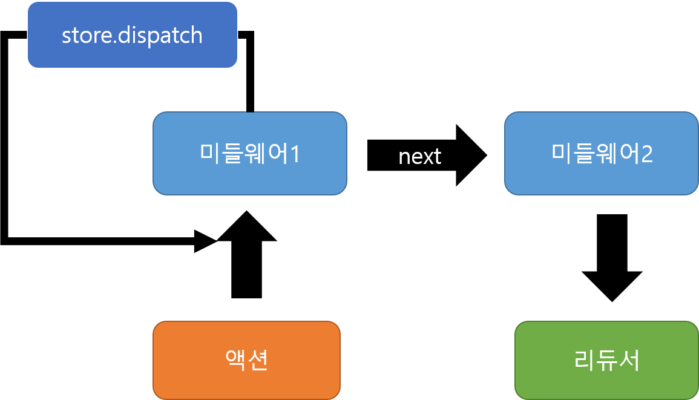

# redux
## Immutable.js
- 자바스크립트에서 불변성 테이더를 다룰 수 있도록 도와주는 라이브러리 
## 객체 불변성
```js
let a = 7;
let b = 7;
a === b 
// true

let object1 = {a:1, b:2};
let object2 = {a:1, b:2};
object1 === object2 
// false (서로 다른 객체)

let object3 = object1
object1 === object3
// true (같은 객체를 가르킴)

object3.c = 3;
object1 === object3
// true
object1
// {a: 1, b: 2, c: 3}

let array1 = [0, 1, 2, 3, 4];
let array2 = array1;
array2.push(5);
array1 === array2 
// true
```
- 리액트 컴포넌트는 state나 props가 변경 되었을때 `리렌더링`이 일어난다. 따라서, 배열이나 객체를 `직접` 수정하면 레퍼런스가 가리키는 곳이 같아서 같은 객체로 인식하고, 리렌더링이 일어나지 않는다.
    > 객체나 배열 update시 `새로운` 객체나 배열을 만들어야한다.
```js
let object1 = {
    a: 1,
    b: 2,
    c: 3,
    d: {
        e: 4,
        f: {
            g: 5,
            h: 6
        }
    }
};
```
- h값을 10으로 update
```js
let object2= {
    ...object1,
    d: {
        ...object1.d,
        f: {
            ...object1.d.f,
            h: 10
        }
    }
};
```
- Immutable.js 라이브러리 사용
```js
let object1 = Map({
    a: 1,
    b: 2,
    c: 3,
    d: Map({
        e: 4,
        f: Map({
            g: 5,
            h: 6
        })
    })
});

let object2 = object1.setIn(['d','f','h'], 10);
object1 === object2;
// false
```
## Immutable.js
1. Map - 객체
2. List - 배열
## Map
- Immutable에서 `객체` 대신 사용하는 데이터 구조
```js
const {Map} = Immutable;
// Map함수 안에 객체를 넣어서 사용한다.
const data = Map({
    a: 1,
    b: 2,
    c: Map({
        d: 3,
        e: 4
    })
});
```
### fromJS
- 내부 객체들은 Map을 사용 하지 않아도 된다.
```js
const {Map, fromJS} = Immutable;

const data = fromJS({
    a: 1,
    b: 2,
    c: {
        d: 3,
        e: 4
    }
});
```
<!-- ### 사용
1. Immutable -> 일반 객체 변환
    ```javascript
    const deserialized = data.toJS();
    ```
2. 특정 키 값 불러오기
    ```javascript
    data.get('a'); // 1 
    data.getIn(['c','d']); //3
    ```
3. 값 설정
    - set : 새로운 Map을 반환한다.
    ```js
    const newData = data.set('a', 4);
    const newData2 = data.setIn(['c','d'], 10);
    ``` -->

## List
1. value list
    ```js
    const {List} = Immutable;
    const list = List([0, 1, 2, 3, 4]);
    ```
2. 객체 list
    ```js
    const {List, Map, fromJS} = Immutable;
    const list1 = List({
        map({value: 1}),
        map({value: 2})
    });
    const list2 = fromJS([
        {value: 1},
        {value: 2}
    ])
    ```
<!-- 3. GET
```
list.get(0);
list.getIn([0, 'value']);
```
4. SET
```
const newList = list.set(0, Map({value: 10}))
``` -->

# Ducks 파일 구조

## Selective code
1. redux/actions/backgroundImage.js


2. redux/reducers/backgroundImage.js


### duck 패턴 사용

1. redux/ducks/backgroundImage.js


# redux-actions
1. createAction
2. handleActions

## createAction
- 액션 생성 자동화
```js
export const increment = (index) => ({
    type: types.INCREMENT,
    index
});

export const increment = createAction(types.INCREMENT);
increment(3); 
/*
    {
        type: 'INCREMENT'
        payload: 3
    }
*/
```

## handleActions
- reducer에서 switch문을 사용하여 액션 타입을 구분해 주는 일을 도와준다.
- 첫번째 파라미터 : 액션에 따라 실행할 함수
- 두번째 파라미터 : state 기본 값
```js
const reducer = handleActions({
    INCREMENT: (state, action) => ({
        counter: state.counter + action.payload
    }),
    DECREMENT: (state, action) => ({
        counter: state.counter - action.payload
    })
}, {counter: 0});
```


# 리덕스 미들웨어
- 액션을 디스패치했을 떄 리듀서에서 액션을 처리하기 전에 `전처리`과정 수행.
- 콘솔 기록, 액션 취소, 다른 액션을 추가로 디스패치 등 ...
```js
// src/lib/loggerMiddleware.js
const loggerMiddleware = store => next => action => {
    
}
```
- next(action) : 다음 처리할 미들 웨어 or 미들웨어가 없으면 리듀서로 넘겨준다.
- store.dispatch : 액션을 처음부터 디스패치 한다.


### 미들웨어 작성
1. 현재 상태
2. 액션 정보
3. 리듀서가 처리한 다음의 새로운 상태
```js
const loggerMiddleware = store => next => action => {
    //현재 스토어 상태 값 
    console.log('현재 상태', store.getState());
    // 액션 기록
    console.log('액션', action);

    // 액션을 다음 미들웨어 또는 리듀서로 넘긴다.
    const result = next(action);

    console.log('다음 상태', store.getState());
    console.log('\n');
    return result;// 여기서 반환하는 값은 store.dispatch(ACTION_TYPE) 했을때의 결과로 설정됩니다
}
export default loggerMiddleware;
```
### 미들 웨어 적용
- src/store.js

#  비동기 작업을 처리하는 미들웨어 사용
## redux-thunk
- thunk?
    - 특정 작업을 나중에 할 수 있도록 미루려로 함수 형태로 감싼 것
    ```js
    const x = 1 + 2; //즉시 실행됨
    const foo = () => 1 + 2; // foo()가 실행될 떄 실행된다.
    ```
- redux-thunk?
    - 미들웨어가 객체가 아닌 함수도 디스패치 할 수 있게 한다.
    - 특정 액션을 디스패치한 후 몇 초 뒤에 반영 시키거나, 무시하게 만들 수 있다. (액션 객체로는 불가능)
    ```js
    const INCREMENT_COUNTER = 'INCREMENT_COUNTER';
    function increment() {
        return {
            type: INCREMENT_COUNTER
        }
    }

    function incrementAsync() {
        return dispatch => { //dispatch를 파라미터로 가진 함수를 리턴한다.
            // 1초뒤에 dispatch
            setTimeout(() => {
                dispatch(increment());
            }, 1000);
        };
    }
    ```

    - 조건에 따라서 액션을 디스패치하거나 무시
    ```js
    function incrementIfOdd() {
        return (dispatch, getState) => { 
            // return 되는 함수에서 disptach, getState를 파라미터로 받게되면 스토어 상태에 접근 할 수 있다.
            const {counter} = getState();
            if(counter % 2 === 0) {
                return;
            }
            dispatch(increment());
        };
    }
    ```
    - 액션 객체가 아니라 함수를 반환하는 함수는 액션 생성 함수가 아니라 `thunk 생성 함수`
    - `thunk 생성 함수`에는 **dispatch**와 **getState**를 파라미터로 가지는 새로운 함수를 반환해야한다.

## Container components and Presentational components
1. Container components
    - 기능을 어떻게 진행할지 관련
    - Presentational, Container components 둘다 가질 수 있고, 자신을 감싸는 div이외의 dom markup(style)을 가지지 않는다.
    - data, behavior을 presentational or other container components에 제공해준다. 
    - action을 부르고(call), callback을 presentational 컴포넌트에 넘긴다.
    - 보통 Higher Order Components로 생성된다.
        - react redux에서는 connect로 구현된다.
2. Presentational components
    - ui가 어떻게 보일 것인지 관련
    - Presentational, Container components 둘다 가질 수 있고, 자신의 dom markup(style)을 가지고 있다.
    - props를 통해서 data를 받거나, callback 함수를 받는다.
    - 거의 state를 갖지 않으며, state가 있다면 UI의 상태와 관련되어있다.
    - 상태라, 라이프사이클, 성능 최적화가 필요하지않으면 functional components로 만들어진다.

- 이점
    - 관심 분리 : ui 이해가 쉬워진다.
    - 재사용 : presentaional components를 재사용하기 쉬워진다. 

컨테이너 컴포넌트는 리덕스와 리액트를 결합하는 얇은 레이어다.