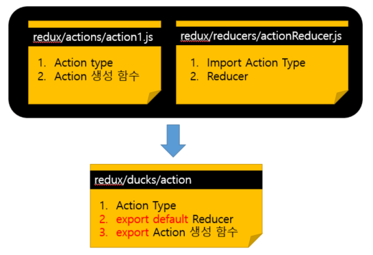
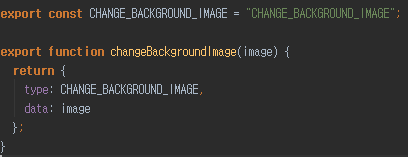
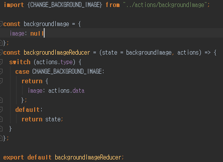
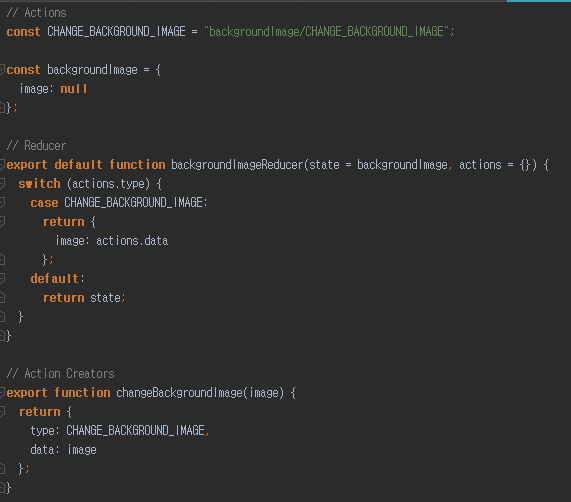

# redux
## Immutable.js
- 자바스크립트에서 불변성 테이더를 다룰 수 있도록 도와주는 라이브러리 
## 객체 불변성
```js
let a = 7;
let b = 7;
a === b 
// true

let object1 = {a:1, b:2};
let object2 = {a:1, b:2};
object1 === object2 
// false (서로 다른 객체)

let object3 = object1
object1 === object3
// true (같은 객체를 가르킴)

object3.c = 3;
object1 === object3
// true
object1
// {a: 1, b: 2, c: 3}

let array1 = [0, 1, 2, 3, 4];
let array2 = array1;
array2.push(5);
array1 === array2 
// true
```
- 리액트 컴포넌트는 state나 props가 변경 되었을때 `리렌더링`이 일어난다. 따라서, 배열이나 객체를 `직접` 수정하면 레퍼런스가 가리키는 곳이 같아서 같은 객체로 인식하고, 리렌더링이 일어나지 않는다.
    > 객체나 배열 update시 `새로운` 객체나 배열을 만들어야한다.
```js
let object1 = {
    a: 1,
    b: 2,
    c: 3,
    d: {
        e: 4,
        f: {
            g: 5,
            h: 6
        }
    }
};
```
- h값을 10으로 update
```js
let object2= {
    ...object1,
    d: {
        ...object1.d,
        f: {
            ...object1.d.f,
            h: 10
        }
    }
};
```
- Immutable.js 라이브러리 사용
```js
let object1 = Map({
    a: 1,
    b: 2,
    c: 3,
    d: Map({
        e: 4,
        f: Map({
            g: 5,
            h: 6
        })
    })
});

let object2 = object1.setIn(['d','f','h'], 10);
object1 === object2;
// false
```
## Immutable.js
1. Map - 객체
2. List - 배열
## Map
- Immutable에서 `객체` 대신 사용하는 데이터 구조
```js
const {Map} = Immutable;
// Map함수 안에 객체를 넣어서 사용한다.
const data = Map({
    a: 1,
    b: 2,
    c: Map({
        d: 3,
        e: 4
    })
});
```
### fromJS
- 내부 객체들은 Map을 사용 하지 않아도 된다.
```js
const {Map, fromJS} = Immutable;

const data = fromJS({
    a: 1,
    b: 2,
    c: {
        d: 3,
        e: 4
    }
});
```
<!-- ### 사용
1. Immutable -> 일반 객체 변환
    ```javascript
    const deserialized = data.toJS();
    ```
2. 특정 키 값 불러오기
    ```javascript
    data.get('a'); // 1 
    data.getIn(['c','d']); //3
    ```
3. 값 설정
    - set : 새로운 Map을 반환한다.
    ```js
    const newData = data.set('a', 4);
    const newData2 = data.setIn(['c','d'], 10);
    ``` -->

## List
1. value list
    ```js
    const {List} = Immutable;
    const list = List([0, 1, 2, 3, 4]);
    ```
2. 객체 list
    ```js
    const {List, Map, fromJS} = Immutable;
    const list1 = List({
        map({value: 1}),
        map({value: 2})
    });
    const list2 = fromJS([
        {value: 1},
        {value: 2}
    ])
    ```
<!-- 3. GET
```
list.get(0);
list.getIn([0, 'value']);
```
4. SET
```
const newList = list.set(0, Map({value: 10}))
``` -->

# Ducks 파일 구조

## Selective code
1. redux/actions/backgroundImage.js



2. redux/reducers/backgroundImage.js



### duck 패턴 사용

1. redux/ducks/backgroundImage.js



## redux-actions
1. createAction
2. handleActions

## createAction
- 액션 생성 자동화
```js
export const increment = (index) => ({
    type: types.INCREMENT,
    index
});

export const increment = createAction(types.INCREMENT);
increment(3); 
/*
    {
        type: 'INCREMENT'
        payload: 3
    }
*/
```

## handleActions
```

```


# 리덕스 미들웨어
- 액션을 디스패치했을 떄 리듀서에서 액션을 처리하기 전에 `전처리`과정 수행.
- 콘솔 기록, 액션 취소, 다른 액션을 추가로 디스패치 등 ...
